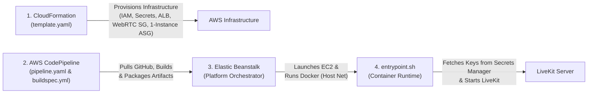

# LiveKit Server on AWS Elastic Beanstalk (1-Instance Standalone Architecture)

This repository provides the complete Infrastructure as Code (IaC), AWS CodePipeline CI/CD pipeline, and container runtime for deploying a **1-Instance Standalone LiveKit WebRTC Server** on **AWS Elastic Beanstalk** with **Docker on 64-bit Amazon Linux 2023** in region **`ap-southeast-1`**.

---

## 🏗️ 4-Tier Operational Architecture



1. **CloudFormation Infrastructure ([`template.yaml`](template.yaml))**: Single authoritative source of truth for all infrastructure:
   - Explicit **`LiveKitSecurityGroup`** with rules for Port 7880 (Signaling/Health), UDP 50000-60000 (RTP Media), and TCP 7881 (ICE TCP).
   - AWS Secrets Manager with auto-generated non-predictable credentials (`GenerateSecretString`).
   - Scoped IAM EC2 Role (`AWSElasticBeanstalkWebTier`, `AmazonSSMManagedInstanceCore`) and Instance Profile.
   - Elastic Beanstalk Application & Environment with explicit **Application Load Balancer (ALB)**, Port 80 & 443 (HTTPS/WSS) listeners, and public IP allocation (`AssociatePublicIpAddress: 'true'`).
   - Standalone Capacity (`Min: 1, Max: 1`) eliminating Redis cluster dependencies.
   - Health-based rolling update policies with additional batch (`RollingWithAdditionalBatch`).
2. **AWS-Native CI/CD Pipeline ([`pipeline.yaml`](pipeline.yaml) & [`buildspec.yml`](buildspec.yml))**:
   - **Source**: Automated GitHub integration via **AWS CodeStar Connections** (v2 GitHub OAuth connection).
   - **Build**: **AWS CodeBuild** executes `buildspec.yml` to validate configuration integrity and package runtime artifacts into an encrypted S3 artifact store.
   - **Deploy**: AWS CodePipeline triggers rolling deployments directly to the Elastic Beanstalk environment.
3. **Elastic Beanstalk Platform**: Provisions the EC2 instance (`t3.medium` cost-effective baseline / `c6i.large` production), executes the container using **Docker Host Networking** (`network_mode: "host"`), monitors health on `/` (Port 7880), and executes rolling deployments.
4. **`entrypoint.sh` Container Runtime ([`entrypoint.sh`](entrypoint.sh))**: Runs on boot, retrieves credentials securely from **AWS Secrets Manager** with fail-closed error handling, dynamically generates runtime configuration in memory (`/tmp/livekit-runtime.yaml`), and launches `livekit-server`.

---

## 📁 Repository Structure

```
.
├── template.yaml                  # Core CloudFormation template (ALB, WebRTC SG, IAM, Secrets, EB Env)
├── pipeline.yaml                  # CI/CD CloudFormation template (AWS CodePipeline, CodeBuild, S3, IAM)
├── buildspec.yml                  # AWS CodeBuild build & artifact packaging specification
├── deploy.sh                      # Deployment coordinator script (CLI fallback & local zip packaging)
├── Dockerfile                     # Multi-stage Docker image with pinned LiveKit v1.8.3
├── docker-compose.yml             # Host networking container orchestration
├── entrypoint.sh                 # Fail-closed Secrets Manager secret loader & launcher
├── livekit.yaml                  # LiveKit base config with STUN external IP discovery
├── .ebextensions/
│   └── 01_sysctl_tuning.config   # Linux kernel UDP buffer and socket limits tuning
├── diagram/
│   └── architecture.eraserdiagram# Cloud architecture diagram (Eraser.io DSL)
└── docs/
    ├── Workload_Assessment.md    # Formal assessment & platform justification
    ├── Architecture_Guide.md     # Traffic flow diagrams, port mapping, and IAM policies
    ├── Learnings.md              # Retrospective, technical gotchas & resolutions
    └── Evidence_Collection_Checklist.md # Step-by-step evidence & screenshot guide
```

---

## 🚀 Deployment Instructions

### 1. Automated CI/CD via AWS CodePipeline (Recommended)

#### Step 1: Deploy the CI/CD Pipeline Stack
```bash
aws cloudformation deploy \
  --template-file pipeline.yaml \
  --stack-name livekit-pipeline-stack \
  --capabilities CAPABILITY_NAMED_IAM \
  --parameter-overrides \
      GitHubRepo="kumaresan0206/livekit-beanstalk" \
      GitHubBranch="main" \
      EBApplicationName="livekit-server" \
      EBEnvironmentName="livekit-production" \
  --region ap-southeast-1
```

#### Step 2: Authorize GitHub Connection (One-Time Setup in AWS Console)
1. Open the [AWS Developer Tools Console > Connections](https://ap-southeast-1.console.aws.amazon.com/codesuite/settings/connections?region=ap-southeast-1).
2. Locate the connection `livekit-production-github-conn` (Status: `Pending`).
3. Click **Update pending connection** and complete the OAuth authorization to your GitHub repository `kumaresan0206/livekit-beanstalk`.
4. The connection status will transition to **Available**.

#### Step 3: Automated Execution
Every `git push` to `main` will automatically trigger **AWS CodePipeline**:
1. **Source**: Pulls the latest commit from GitHub.
2. **Build**: CodeBuild validates configs and packages the bundle via `buildspec.yml`.
3. **Deploy**: Deploys the new application version to `livekit-production` with rolling updates.

---

### 2. Manual CLI Deployment via Coordinator Script (Fallback)

```bash
chmod +x deploy.sh

# Deploy to ap-southeast-1
./deploy.sh
```

---

## 📚 Documentation & Assessment Evidence

- **[Workload Assessment](docs/Workload_Assessment.md)**
- **[Architecture Guide](docs/Architecture_Guide.md)**
- **[Technical Learnings & Retrospective](docs/Learnings.md)**
- **[Evidence Collection Checklist](docs/Evidence_Collection_Checklist.md)**
