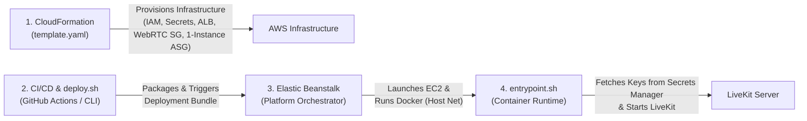

# LiveKit Server on AWS Elastic Beanstalk (1-Instance Standalone Architecture)

This repository provides the complete Infrastructure as Code (IaC), CI/CD pipeline, and container configuration for deploying a **1-Instance Standalone LiveKit WebRTC Server** on **AWS Elastic Beanstalk** with **Docker on 64-bit Amazon Linux 2023**.

---

## 🏗️ 4-Tier Operational Architecture



1. **CloudFormation ([`template.yaml`](template.yaml))**: Single authoritative source of truth for all infrastructure:
   - Explicit **`LiveKitSecurityGroup`** with rules for Port 7880 (Signaling/Health), UDP 50000-60000 (RTP Media), and TCP 7881 (ICE TCP).
   - AWS Secrets Manager with auto-generated non-predictable credentials (`GenerateSecretString`).
   - Scoped IAM EC2 Role (`AWSElasticBeanstalkWebTier`, `AmazonSSMManagedInstanceCore`) and Instance Profile.
   - Elastic Beanstalk Application & Environment with explicit **Application Load Balancer (ALB)**, Port 80 & 443 (HTTPS/WSS) listeners, and public IP allocation (`AssociatePublicIpAddress: 'true'`).
   - Standalone Capacity (`Min: 1, Max: 1`) eliminating Redis cluster dependencies.
   - Health-based rolling update policies with additional batch (`RollingWithAdditionalBatch`).
2. **CI/CD & Coordinator ([`.github/workflows/deploy.yml`](.github/workflows/deploy.yml) & [`deploy.sh`](deploy.sh))**: Packages runtime artifacts (`Dockerfile`, `docker-compose.yml`, `entrypoint.sh`, `livekit.yaml`, `.ebextensions/`), uploads the bundle to S3, and triggers Beanstalk rolling deployments in region `ap-southeast-1`.
3. **Elastic Beanstalk**: Provisions the EC2 instance (`t3.medium` cost-effective baseline / `c6i.large` production), executes the container using **Docker Host Networking** (`network_mode: "host"`), monitors health on `/` (Port 7880), and executes rolling deployments.
4. **`entrypoint.sh` ([`entrypoint.sh`](entrypoint.sh))**: Runs on boot, retrieves credentials securely from **AWS Secrets Manager** with fail-closed error handling, dynamically generates runtime configuration, and launches `livekit-server`.

---

## 📁 Repository Structure

```
.
├── .github/workflows/
│   └── deploy.yml                 # Automated CI/CD deployment pipeline (GitHub Actions)
├── template.yaml                  # Pure CloudFormation template (Infra, ALB, WebRTC SG, IAM, Secrets)
├── deploy.sh                      # Deployment coordinator script (Packages & updates EB)
├── Dockerfile                     # Multi-stage Docker image with pinned LiveKit v1.8.3
├── docker-compose.yml             # Host networking container orchestration
├── entrypoint.sh                 # Fail-closed Secrets Manager secret loader & launcher
├── livekit.yaml                  # LiveKit base config with STUN external IP discovery
├── .ebextensions/
│   └── 01_sysctl_tuning.config   # Linux kernel UDP buffer and socket limits tuning
└── docs/
    ├── Workload_Assessment.md    # Formal assessment & platform justification
    ├── Architecture_Guide.md     # Traffic flow diagrams, port mapping, and IAM policies
    └── Evidence_Collection_Checklist.md # Step-by-step evidence & screenshot guide
```

---

## 🚀 Deployment Instructions

### 1. Automated Deployment via CI/CD (GitHub Actions)
Configure the following Repository Secrets in GitHub (`Settings -> Secrets and variables -> Actions`):
- `AWS_ACCESS_KEY_ID`: AWS IAM access key
- `AWS_SECRET_ACCESS_KEY`: AWS IAM secret access key
- `ACM_CERTIFICATE_ARN`: (Optional for testing, required for production WSS:443) ACM SSL Certificate ARN in `ap-southeast-1`

Pushing to `main` or `master` will trigger the automated deployment pipeline in region `ap-southeast-1`.

### 2. Manual CLI Deployment via Coordinator Script

#### A. Production Deployment (WSS:443 via ACM Certificate & t3.medium)
```bash
chmod +x deploy.sh

CERTIFICATE_ARN="arn:aws:acm:ap-southeast-1:123456789012:certificate/your-cert-id" \
./deploy.sh
```

#### B. Testing / POC Deployment (t3.medium + HTTP:80)
```bash
chmod +x deploy.sh

./deploy.sh
```

---

## 📚 Documentation & Assessment Evidence

- **[Workload Assessment](docs/Workload_Assessment.md)**
- **[Architecture Guide](docs/Architecture_Guide.md)**
- **[Evidence Collection Checklist](docs/Evidence_Collection_Checklist.md)**
