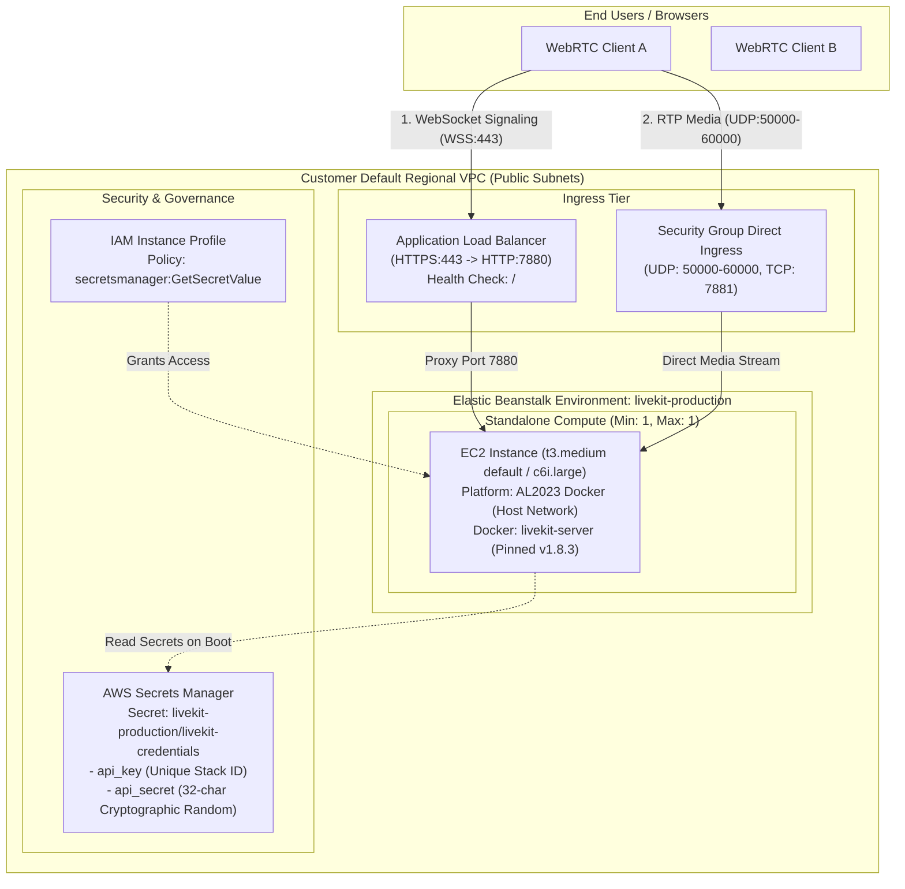

# Architecture Guide: LiveKit on AWS Elastic Beanstalk

## 1. Network & Traffic Flow Topology



---

## 2. Ingress & Port Allocation Mapping

| Port Range | Protocol | Routing Path | Purpose | Security Justification |
| :--- | :--- | :--- | :--- | :--- |
| **443** | TCP (HTTPS/WSS) | Client $\rightarrow$ ALB $\rightarrow$ EC2:7880 | Signaling, Room token authentication, WebSockets, and health checks | TLS terminated at ALB with ACM SSL certificate |
| **80** | TCP (HTTP) | Client $\rightarrow$ ALB $\rightarrow$ EC2:7880 | Plaintext HTTP listener for initial verification / staging | Fallback port |
| **7880** | TCP (HTTP) | ALB $\rightarrow$ EC2 Container | Backend signaling listener and `/` healthcheck target | Restricted to ALB security group |
| **7881** | TCP | Client $\rightarrow$ EC2 Instance Directly | WebRTC ICE over TCP fallback | Direct host ingress (Accepted WebRTC standard) |
| **50000–60000** | UDP | Client $\rightarrow$ EC2 Instance Directly | WebRTC RTP/SRTP Audio and Video media packets | Direct host ingress (Accepted WebRTC standard) |

---

## 3. Network & Infrastructure Ownership

The deployment is intentionally designed to launch inside the **Customer's Default Regional VPC**:
- **Ownership**: The customer's AWS account owns the Default VPC, its default Internet Gateway, public subnets across availability zones, and regional route tables.
- **Scope**: This IaC deploys the Elastic Beanstalk application, EC2 compute, ALB, security groups, and Secrets Manager. VPC creation is outside this stack's scope and assumed pre-existing.

---

## 4. Security & Secrets Architecture

### Credential Generation
Credentials are created by AWS Secrets Manager at stack creation:
- **`api_key`**: Environment-derived identifier (`LK_${AWS::StackName}_${AWS::Region}`).
- **`api_secret`**: 32-character cryptographically random string generated via Secrets Manager's `GenerateSecretString`.

### EC2 IAM Instance Profile Policy
The Elastic Beanstalk EC2 instance profile is configured with least-privilege permissions, matching [`template.yaml`](../template.yaml) exactly:

```json
{
  "Version": "2012-10-17",
  "Statement": [
    {
      "Effect": "Allow",
      "Action": [
        "secretsmanager:GetSecretValue",
        "secretsmanager:DescribeSecret"
      ],
      "Resource": "the exact ARN returned by the SecretsManagerSecretArn CloudFormation output"
    }
  ]
}
```

---

## 5. Standalone Compute & Resiliency

- **Capacity**: Baseline is set to **1 instance (`Min: 1, Max: 1`)**. Standalone mode removes Redis clustering overhead while delivering high performance.
- **Rolling Deployments**: Configured with `RollingWithAdditionalBatch` to ensure automated health-verified rollouts during application updates.
